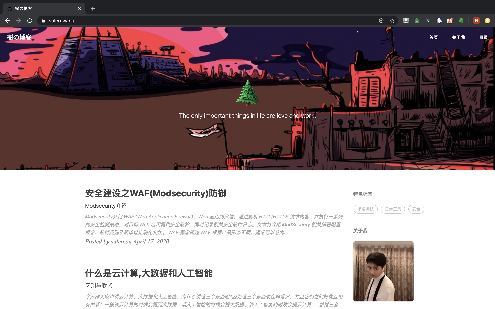

# 概述

#### 使用github page 和 jekyll 搭建个人博客


## 环境准备
- [jekyll安装文档](https://www.jekyll.com.cn/docs/installation/)
- [选取你喜欢的博客模版并fork他们的github库并拉取到本地](https://www.jekyll.com.cn/resources/)
- [创建你的github page,用作博客托管站点](https://guides.github.com/features/pages/)
- 进到你拉取的仓库, 运行 :  **jekyll server**
- 访问本地站点:  **127.0.0.1:4000**


### 开始自定义(调试)你的博客

> 你可以通用修改 `_config.yml`文件来轻松的开始搭建自己的博客:

```shell
# Site settings
title:    Blog              # 你的博客网站标题
SEOTitle: Blog		          # SEO 标题
description: "Hey"	   	    # 随便说点，描述一下

# SNS settings      
github_username: test       # 你的github账号

# Build settings
# paginate: 10              # 一页你准备放几篇文章
```


### 撰写博文

> 要发表的文章一般以 **Markdown** 的格式放在这里`_posts/`,  你只要看看这篇模板里的文章你就立刻明白该如何设置.  

yaml 头文件长这样:

```shell
---
layout:     post
title:      标题
subtitle:   副标题
date:       2020-04-13
author:     作者      
header-img: img/xx.jpg  # 该博客背景
catalog: 	 true         # 是否归档
tags:                   # 标签
    - 标签名
---

```


### 侧边栏

> 设置是在 `_config.yml`文件里面的`Sidebar settings`那块

```
# Sidebar settings
sidebar: true      #添加侧边栏
sidebar-about-description: "简单的描述一下你自己"
sidebar-avatar: /img/xx.jpg     #你的头像,请使用绝对地址,注意写对图片名称大小写
```

⚠️ 侧边栏是响应式布局的,  当屏幕尺寸小于992px的时候,  侧边栏就会移动到底部 .

[具体请见bootstrap栅格系统]( <http://v3.bootcss.com/css/>)


### 我的信息

> Mini-About-Me 这个模块将在你的头像下面,  展示你所有的社交账号.  这个也是响应式布局,  当屏幕变小时候,  会将其移动到页面底部, 只不过会稍微有点小变化,  具体请看代码. 

```
# Featured Tags
featured-tags: true  
featured-condition-size: 1     # A tag will be featured if the size of it is more than this condition value
```

> 唯一需要注意的是`featured-condition-size`: 如果一个标签的 SIZE, 也就是使用该标签的文章数大于上面设定的条件值,  这个标签就会在首页上被推荐. 

### 社交账号

```
# SNS settings
RSS: false
jianshu_username: 	jianshu_id 
zhihu_username:     username
facebook_username:  username
github_username:    username
# weibo_username:   username
```


### 友链🔗

> 好友链接部分, 这会在全部页面显示.  

设置是在 `_config.yml`文件里面的`Friends`那块, 自己添加.  

```
# Friends
friends: [
    {
        title: "张三",
        href: "https://xxxxxx.github.io/"
    },
    {
        title: "Apple",
        href: "https://apple.com/"
    }
]
```


### 幻灯片布局

> HTML5幻灯片的排版(Keynote Layout)：
>              这部分是用于占用html格式的幻灯片的,  一般用到的是 Reveal.js、Impress.js、Slides、Prezi 等等.我认为一个现代化的博客怎么能少了放html幻灯的功能 ! ? 

其原理是添加一个 `iframe`,  在里面加入外部链接.  可以直接写到头文件里,  详情请见下面的yaml头文件的写法. iframe在不同的设备中,  将会自动的调整大小.  保留内边距是为了让手机用户可以向下滑动,  以及添加更多的内容 . 

```
---
layout:     keynote
iframe:     "http://huangxuan.me/js-module-7day/"
---
```


### 评论插件

> 博客不仅支持 [Disqus](http://disqus.com) 评论系统,还加入了 [Gitalk](https://gitalk.github.io/) 评论系统，[支持 Markdwon 语法](https://guides.github.com/features/mastering-markdown/)，cool~

#### Disqus

**优点 :** 国际比较流行，界面也很大气、简洁，如果有人评论，还能实时通知，直接回复通知的邮件就行了；

**缺点 :** 评论必须要去注册一个disqus账号，分享一般只有Facebook和Twitter，另外在墙内加载速度略慢了一点。想要知道长啥样，可以看以前的版本点[这里](http://brucezhaor.github.io/about.html) 最下面就可以看到。

> Node：有很多人反映 Disqus 插件加载不出来，可能墙又架高了，有条件的话翻个墙就好了~

**使用：**

​    注册一个Disqus帐号. **不要直接使用我的啊！**

​    在下面的 yaml 头文件中进行设置 . 

```
# 评论系统
# Disqus（https://disqus.com/）
disqus_username: admin
```

#### Gitalk

**优点 :** 界面干净简洁, 利用 Github issue API 做的评论插件, 使用 Github 帐号进行登录和评论, 最喜欢的支持 Markdown 语法, 对于程序员来说真是太 cool 了. 

**缺点 : **配置比较繁琐, 每篇文章的评论都需要初始化. 


### 统计

网站分析，现在支持百度统计和Google Analytics。需要去官方网站注册一下，然后将返回的code贴在下面：

```
# Baidu Analytics
ba_track_id: xxxxxxx

# Google Analytics
ga_track_id: 'xxxx'        # 你用Google账号去注册一个就会给你一个这样的id
ga_domain: xx.xx			     # 默认的是auto,这里我是自定义了的域名,你如果没有自己的域名,需要改成auto
```

#### Customization

如果你喜欢折腾, 你可以去自定义这个模板的 Code. 

**如果你可以理解 `_include/` 和 `_layouts/`文件夹下的代码(这里是整个界面布局的地方), 你就可以使用 Jekyll 使用的模版引擎 [Liquid](https://github.com/Shopify/liquid/wiki)的语法直接修改/添加代码, 来进行更有创意的自定义界面啦！**


#### Header Image

博客每页的标题底图是可以自己选的, 看看几篇示例post你就知道如何设置了.  

标题底图的选取完全是看个人的审美了, 每一篇文章可以有不同的底图,你想放什么就放什么.  

> 上传的图片最好先压缩，这里推荐 imageOptim 图片压缩软件，让你的博客起飞. 

> 但是需要注意的是本模板的标题是**白色**的, 所以背景色要设置为**灰色**或者**黑色**, 总之深色系就对了. 当然你还可以自定义修改字体颜色, 总之, 用github pages就是可以完全的个性定制自己的博客. 


### SEO 标题

我的博客标题是 **“树的博客”** 但是我想要在搜索的时候显示 **“树的博客”** , 这个就需要 SEO 标题 来定义了. 

其实这个 SEO Title 就是定义了<head><title>标题</title></head>这个里面的东西和多说分享的标题, 你可以自行修改 . 


### 关于收到"Page Build Warning"的 Email

由于jekyll升级到3.0.x,对原来的 pygments 代码高亮不再支持，现只支持一种-rouge，所以你需要在 `_config.yml`文件中修改`highlighter: rouge`.另外还需要在`_config.yml`文件中加上`gems: [jekyll-paginate]`.

同时,你需要更新你的本地 jekyll 环境.

使用`jekyll server`的同学需要这样：

1. `gem update jekyll` # 更新jekyll
2. `gem update github-pages` #更新依赖的包

使用`bundle exec jekyll server`的同学在更新 jekyll 后，需要输入`bundle update`来更新依赖的包.

> Note：
> 可以使用 `jekyll -s` 命令在本地实时配置博客，提高效率。详见 [Jekyll.com](http://jekyllcn.com/)

参考文档：[using jekyll with pages](https://help.github.com/articles/using-jekyll-with-pages/) & [Upgrading from 2.x to 3.x](http://jekyllrb.com/docs/upgrading/2-to-3/)


## 致谢

1. 这个模板是基于 [qiubaiying](https://github.com/qiubaiying/qiubaiying.github.io)的仓库, 感谢这个作者。 
2. 感谢 Jekyll、Github Pages 和 Bootstrap!


